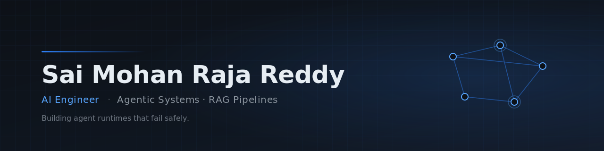

  
  
  

---

## I build LLM systems that run unattended

The model call is the easy part. The hard part is everything around it — validation, retries, recovery, and knowing when the system is confidently wrong.

Most of my work is in **restaurant technology**: document extraction pipelines processing real invoices for real operators, and a multi-tenant RAG assistant serving 1,000+ users. Both taught the same lesson — *an agent that's right 95% of the time is worthless without a way to catch the other 5%.*

**Now:** AI Engineer @ MetaxurX · MS Computer Science, University of Central Missouri
**Building:** agent runtime internals — evaluation harnesses, memory write policies, sandboxed tool execution

---

## Things I've shipped that people actually use

### 🧾 [Ai-Invoice](https://github.com/saimohanrajareddyjannareddy/Ai-Invoice) — invoice extraction, fully autonomous

Scrapes supplier invoices daily, extracts every line item with a vision model, validates, and lands normalized records in a spend ledger. **Running in production for restaurant operators.**

The interesting part isn't the extraction — it's the validation layer that quarantines bad data before it reaches the ledger. Every failure path either quarantines or no-ops. Nothing corrupt gets in silently, nothing is dropped without a trace.

`99%+ line-item accuracy` · `zero corrupted rows since validation shipped` · `~$1.50/month to run`

GPT-4 Vision · Playwright · Supabase · n8n · Node.js

### 💬 Turmeric RAG Assistant — multi-tenant retrieval, 1,000+ users

Conversational assistant for restaurants. Vector retrieval with fallback routing when the index returns nothing useful, and tenant-aware isolation so one restaurant's data never leaks into another's context.

`1,000+ users` · `92% satisfaction` · `multi-tenant by design`

OpenAI · Pinecone · RAG · webhook orchestration

### 🍽️ [SmartMealPlanner](https://github.com/saimohanrajareddyjannareddy/SmartMealPlanner)

Recommendation API with auth and persistent user state, deployed on AWS.

Flask · MongoDB · AWS EC2

---

## Stack

  
  
  
  

  
  
  
  

  
  
  
  

---

## What I'm thinking about

**Verification is the bottleneck.** Generation is nearly solved; knowing whether the generation is *correct* is not. Most production LLM failures I've hit weren't bad outputs — they were bad outputs nobody caught.

**Deterministic beats clever.** Every place I could replace a model call with a rule, the system got more reliable and cheaper. The model should reason. Code should execute.

**Multi-tenancy is a safety problem, not a scaling problem.** Isolation failures in retrieval are silent, and they're the ones that end contracts.

---

---

  Open to AI/ML engineering roles · Authorized to work in the US · St. Louis, MO

